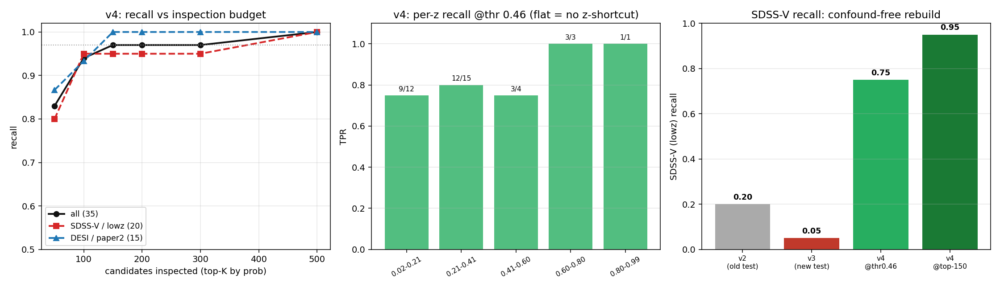
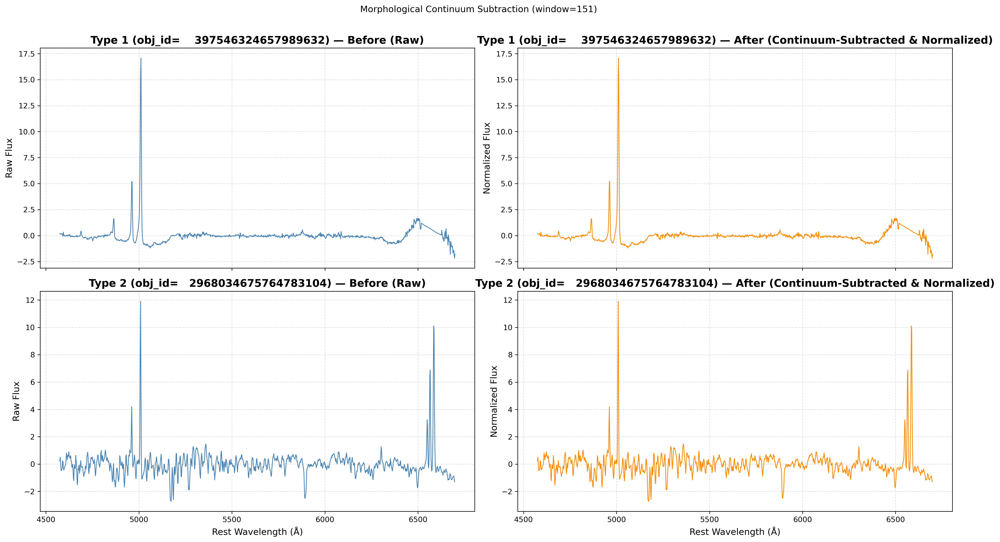
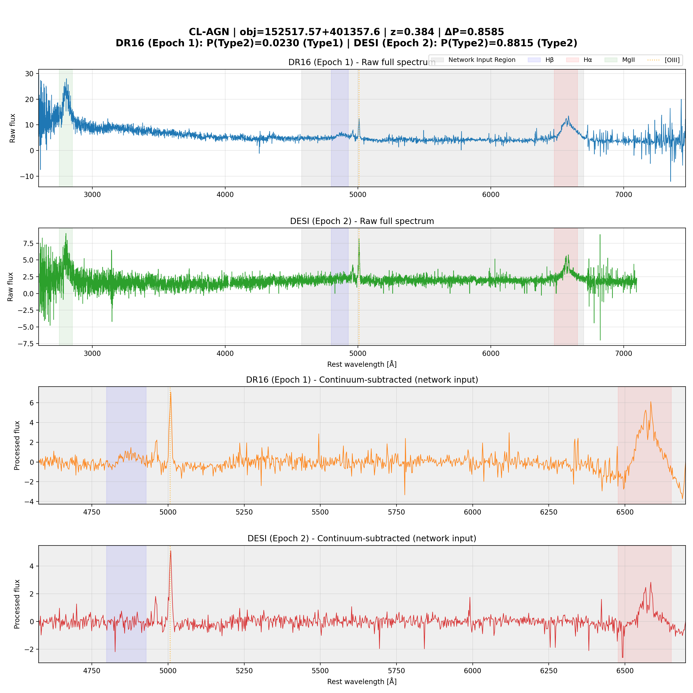
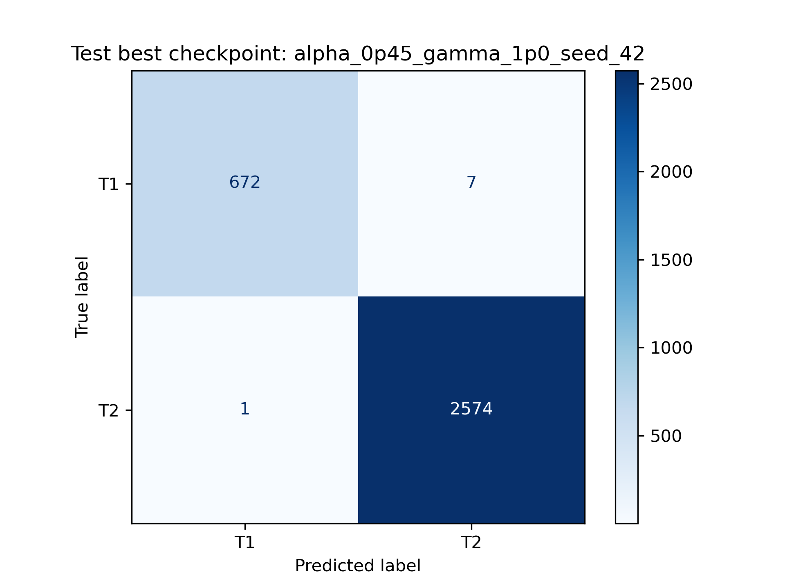
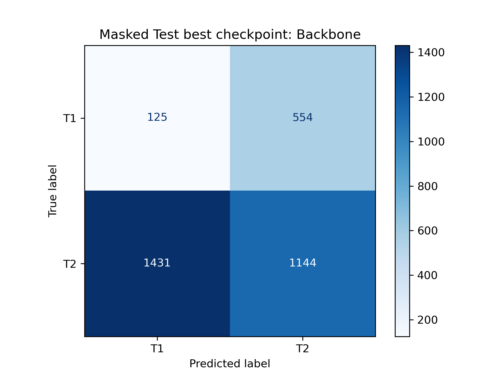
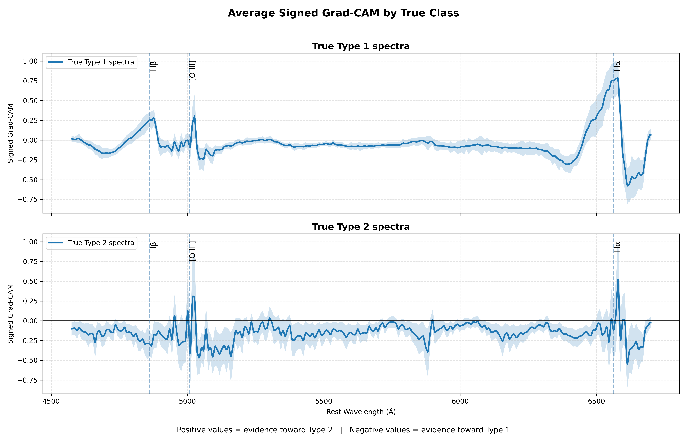
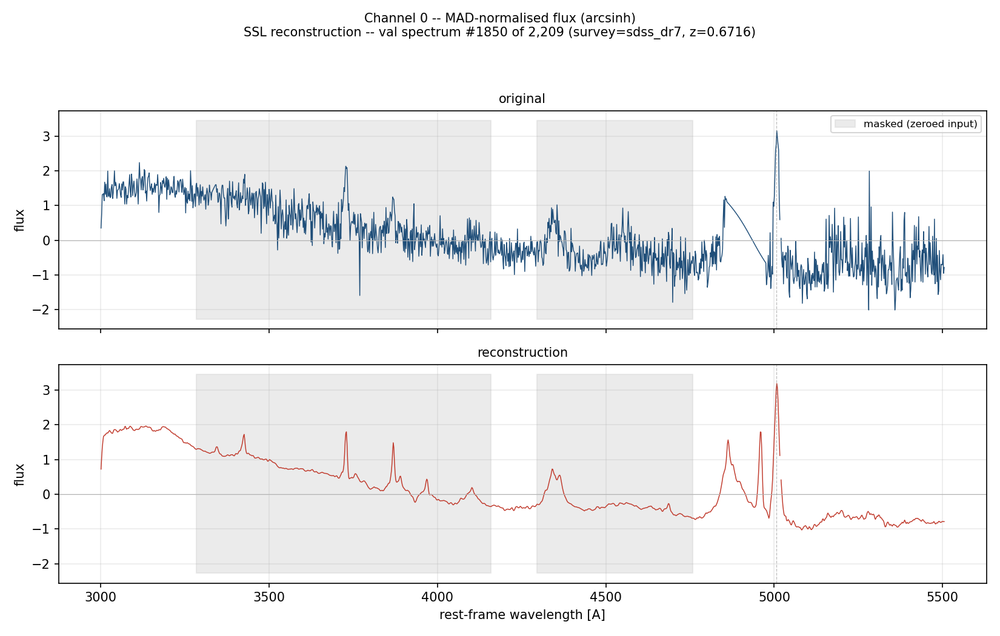
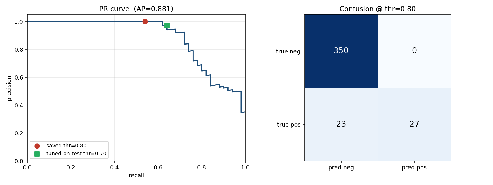
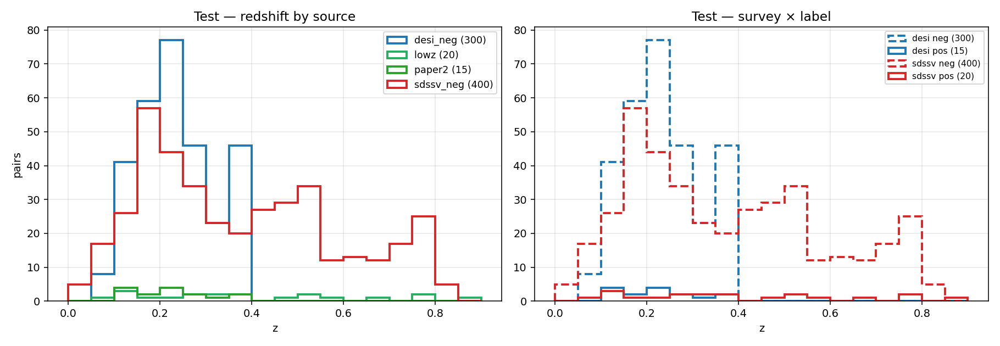

# A Self-Supervised Neural Detector for Changing-Look AGN

*Detecting Type 1 ↔ Type 2 active-galaxy transitions directly from pairs of optical spectra — without spectral-line fitting.*

---

## TL;DR

Given **two optical spectra of the same galaxy taken years apart**, this project trains a neural network to decide whether the object is a **changing-look active galactic nucleus (CL-AGN)** — a galaxy whose central engine visibly switched state between the two epochs. The model is built in two stages: a **self-supervised encoder** pretrained on ~44k–53k *unlabeled* spectra, followed by a **frozen-encoder Siamese head** fine-tuned on a few hundred *real* same-object epoch pairs.

On a held-out test of 50 confirmed CL-AGN and 350 static controls, the final model reaches **precision = 1.000 (zero false positives), recall = 0.54, ROC-AUC = 0.97** at the deployment-time operating threshold. A controlled experiment then shows that **adding two new spectroscopic surveys to the self-supervised pretraining pool closes part of a survey-induced recall gap** — but only via a *full* retrain; a cheaper *continual-learning* variant preserves old performance yet under-adapts to the new survey.

The headline design choice: **no spectral-decomposition / line-fitting algorithm is used anywhere.** The network is meant to *replace* that fitting step, learning the relevant physics from data.

**Update — v4, a recall-first rebuild (§7).** A deeper audit found that the per-survey recall numbers below were partly a **confound**: in the labeled data, *which surveys formed a pair* was correlated with the label, so the network could shortcut on survey / instrument / redshift instead of the physics. v4 rebuilds the labeled set to be confound-free — every pair is **SDSS-DR16 × {SDSS-V | DESI}** with **type-verified negatives so survey ⊥ label** — and reframes the task as a **recall-first candidate ranker** (the real deployment: surface CL-AGN for visual inspection). On the confound-free test, **SDSS-V recall rises from 0.05 → 0.75** at a 3% false-positive rate (≈0.95 at a looser threshold), with **PR-AUC = 0.83** and **97% of all positives recovered in the top-150 ranked candidates** — still no line-fitting, and with **no redshift/survey shortcut** (per-z recall is flat).



---

## Table of contents

1. [Background: AGN, Type 1/2, and changing-look AGN](#1-background)
2. [Data and preprocessing](#2-data-and-preprocessing)
3. [First setup, and what its failures taught us](#3-first-setup-and-what-its-failures-taught-us)
4. [The redesign: self-supervised pretraining + frozen Siamese](#4-the-redesign)
5. [The survey-extension experiment: full retrain vs. continual learning](#5-the-survey-extension-experiment)
6. [Results and conclusions (v2 / Phase A / Phase B)](#6-results-and-conclusions)
7. [v4: removing the confounds — a recall-first rebuild](#7-v4-removing-the-confounds--a-recall-first-rebuild)
8. [Repository layout & reproducing](#8-repository-layout--reproducing)
9. [References](#9-references)

---

## 1. Background

*Written for a technical reader with no astrophysics background.*

### What is an AGN?

Most large galaxies host a **supermassive black hole** (millions to billions of times the mass of the Sun) at their center. When gas falls toward that black hole, it forms a hot, luminous **accretion disk** that can briefly outshine all the stars in the galaxy combined. A galaxy in this state is called an **active galactic nucleus (AGN)**. The light we collect from an AGN is a *spectrum*: brightness as a function of wavelength, which encodes both a smooth **continuum** (the glow of the disk) and sharp **emission lines** (gas atoms near the black hole emitting at specific wavelengths).

### Type 1 vs. Type 2: the two "looks"

Emission lines come in two flavors, and they are the key to this entire project:

- **Broad lines** — emitted by gas clouds orbiting *very close* to the black hole, moving at thousands of km/s. Their motion smears the line out over a wide range of wavelengths (the Doppler effect). Broad lines are the signature of a clear, unobscured view of the inner engine.
- **Narrow lines** — emitted by gas *far* from the black hole (hundreds to thousands of light-years out), moving slowly, producing sharp, narrow lines. The **[O III] 5007 Å** line is the canonical example, and it plays a starring role below.

An AGN that shows **broad + narrow lines** is **Type 1**; one that shows **only narrow lines** is **Type 2**. For decades the textbook ("unified") model explained the difference as pure *geometry*: every AGN is intrinsically the same, and whether you see broad lines just depends on whether a dusty torus happens to block your line of sight. Under that model, an individual object's type should never change on human timescales.

### Changing-look AGN: the engine flips a switch

A **changing-look AGN (CL-AGN)** breaks that picture. It is a single object observed to **transition between Type 1 and Type 2 within years** — broad lines appear ("turn-on") or vanish ("turn-off"), accompanied by a large continuum brightening or dimming. The first luminous example was discovered by [LaMassa et al. (2015)](#9-references); systematic searches since then ([MacLeod et al. 2016, 2019](#9-references); [Guo et al. 2024, 2025](#9-references) with DESI) have grown the sample from one object to hundreds.

**Why it matters.** A geometric obscuration change cannot happen that fast — the dusty torus is light-years across. So CL-AGN are direct evidence that the *accretion flow itself* changes state on observable timescales, a probe of black-hole accretion physics that standard disk theory struggles to explain. They are rare, scientifically valuable, and — crucially for machine learning — **hard to find**: they hide among millions of static AGN, and confirming one traditionally requires careful, hand-tuned spectral fitting of each candidate.

### The machine-learning framing

This project asks: *can a neural network look at two spectra of the same object and flag a CL-AGN transition directly, replacing the per-object line-fitting?* Concretely it is a **binary change-detection problem on spectrum pairs**:

> input = (spectrum at epoch A, spectrum at epoch B) of the **same object** → output = P(this object changed look).

Two constraints are treated as hard rules throughout, because they define what makes the result credible:

1. **No spectral-decomposition / line-fitting algorithm** (e.g. `pyqsofit`) is used. The network must learn to do the job that fitting would otherwise do. The only continuum estimation permitted is a local side-band subtraction under the [O III] line (described below).
2. **Pairs are always same-object, two-epoch.** Building "pairs" from two *different* objects is forbidden — it turns change detection into object discrimination (this was an actual bug in the first iteration; see §3).

---

## 2. Data and preprocessing

### Surveys

Spectra come from four optical spectroscopic surveys, which matters a great deal later because **the survey an epoch comes from is a source of domain shift**:

| Survey | Role | Epoch |
|---|---|---|
| **SDSS DR7** | unlabeled pretraining pool | legacy SDSS |
| **DESI** | unlabeled pretraining pool | recent |
| **SDSS DR16** (BOSS/eBOSS) | first epoch of most labeled pairs | mid |
| **SDSS-V** | second epoch of low-z labeled pairs | newest |

The labeled CL-AGN positives come from two places: a hand-curated low-redshift set (`lowz`, 54 real positives originally) of SDSS-V × DR16 pairs, and the DESI CL-AGN catalog of [Guo et al.](#9-references) (`paper2`, DESI × DR16 pairs), which selected the most dramatic transitions.

### The two-channel spectral representation

Every spectrum is resampled onto a fixed **rest-frame grid: 3000–10400 Å, 4096 pixels** (≈1.81 Å/pixel). Because objects sit at different redshifts, no single spectrum covers the whole grid; pixels outside an object's observed range are **zero-filled and tracked with a per-pixel validity mask**, so spectra at *any* redshift are usable (this removed an earlier, restrictive z < 0.4 cut). Each spectrum is encoded as **two channels**, `x ∈ [2, 4096]`:

- **Channel 0 — MAD-normalized flux (full continuum retained).** Each spectrum is divided by its own median-absolute-deviation, a robust scale estimate. This gives a well-conditioned *shape* channel.
- **Channel 1 — [O III] 5007-normalized flux.** This is the clever part. [O III] is emitted by the *narrow*-line region, which is so physically large that its flux is **constant between epochs years apart**. Dividing each epoch by its own [O III] flux therefore (a) puts both epochs on a common, *physically meaningful* amplitude scale, (b) preserves a real broad-line/continuum change as a genuine cross-epoch difference instead of normalizing it away, and (c) absorbs throughput differences between instruments. The [O III] flux itself is measured with a **local continuum subtracted from two side-bands** (4970–4990 Å and 5020–5045 Å) under the line core (4996–5018 Å), so the anchor stays insensitive to the broad-Hβ pedestal — i.e. insensitive to exactly the thing that changes in a CL-AGN.

Both channels are **arcsinh-compressed** to tame the heavy dynamic-range tail (bright line peaks vs. faint continuum) without the information loss of a hard clip.

### Cleaning and filtering

- **Sky-line removal.** The bright terrestrial [O I] **5577.3 Å** night-sky residual is detected and removed where it spikes above a local threshold, so it can't masquerade as a real feature.
- **Signal-to-noise cut.** Spectra below **SNR ≥ 8** are dropped from the pretraining pool (raised from an earlier 5.0 to keep the self-supervised pool clean).
- **Continuum handling.** A wide moving-average continuum (173-px ≈ 313 Å window, computed only over covered pixels) is available; in the v2 design the continuum is *kept* in channel 0 (see §3 for why removing it was a v1-only workaround).
- **Quality cuts on pairs:** `zwarning = 0`, spectroscopic class `QSO`, redshift range as appropriate to the experiment.



*Raw input spectrum vs. the processed representation: sky lines removed, continuum handled, and the flux placed on the fixed rest-frame grid.*



*A real, publicly-released **DESI × DR16** changing-look pair (obj 152517.57+401357.6, z = 0.384) — the kind of input the detector operates on. **Top two panels:** the raw spectra of the two epochs on the common rest-frame grid, with the diagnostic line regions (Hβ, Hα, Mg II, [O III]) shaded. **Bottom two panels:** the same spectra after continuum subtraction. The broad **Hα** feature (~6563 Å) is a strong, wide bump in the earlier DR16 epoch (a Type 1 state) and has faded in the later DESI epoch (Type 2) — a "turn-off" transition, visible by eye once both epochs are placed on a common processed scale.*

---

## 3. First setup, and what its failures taught us

The redesign in §4 only makes sense against the failures that motivated it. This section documents them in full, because each one is a transferable lesson.

### 3.1 A Type 1 / Type 2 classifier that worked — almost too well

The first model was a **single-spectrum classifier**: a multi-scale 1-D CNN + attention "backbone" (`SpectraNet`) trained to label one spectrum as Type 1 or Type 2. It was extremely accurate on a held-out split:

| Type 1/2 backbone (held-out test) | Value |
|---|---|
| Macro-F1 | **0.996** |
| Balanced accuracy | 0.995 |
| Type 1 recall | 0.990 |
| Type 2 recall | 0.9996 |



Near-perfect numbers on an astrophysics task should trigger suspicion, not celebration. **Was the network reading the physics (the emission lines), or exploiting a shortcut** (continuum color, survey-specific calibration quirks, noise statistics)?

### 3.2 Proving the network relies on the lines

To answer that, we re-ran the *same* trained backbone on the *same* test set, but with the **emission-line regions masked out** of every spectrum. If the model were keying on physically meaningful lines, masking them should destroy its performance. It did:



| Backbone | Type 1 recall | Type 2 recall | Accuracy |
|---|---|---|---|
| Unmasked | 0.990 | 0.9996 | 0.995 |
| **Lines masked** | **0.18** | **0.44** | **0.39** |

With the lines removed the classifier collapses to **39% accuracy — *below* the 79% you'd get by always guessing the majority class.** This is a clean, falsifiable demonstration that the network's decisions are driven by the emission lines, i.e. by the right physics. Gradient-based attribution (Grad-CAM) tells the same story, lighting up on the Balmer and [O III] line positions:



**Lesson 1:** *on a domain where a model can look perfect for the wrong reasons, an ablation that removes the physically meaningful input is worth more than another decimal place of accuracy.*

### 3.3 The change detector that learned the wrong task

Classifying one spectrum is not the goal — *detecting a change between two* is. The natural next step was a **Siamese network** on pairs. The first version posted strong-looking validation numbers (precision 1.0, recall 0.70 at its operating point), but they were **not trustworthy**, for three compounding reasons:

- **Cross-object pairs (a real bug).** The v1 pair-builder constructed training pairs from *different objects*. A network fed (object A, object B) and asked "did it change?" can succeed by simply noticing A and B are different galaxies — it learns **object discrimination, not change detection**. Any metric computed on such pairs is meaningless for the real task. This is why the project now enforces *same-object, two-epoch* pairs as a hard rule.
- **Synthetic positives that didn't transfer.** Real CL-AGN are scarce, so we tried *manufacturing* positives — taking a Type 1 spectrum and algorithmically **suppressing its broad lines** to fake a "turn-off" partner (`make_synthetic_change` / `suppress_broad_lines`). The network learned to detect the *synthetic* operation rather than real astrophysical transitions; the train/test domain shift between fabricated and real changes made the synthetic-trained model unreliable on real pairs. We abandoned synthetic positives once ~500 real ones were assembled.
- **Survey domain shift + an unmeasurable test.** Trained on one survey and evaluated on another (e.g. DESI), the early Siamese ranked objects reasonably (ROC-AUC ≈ 0.92) but had poor precision/recall and a PR-AUC of ~0.18 — and the held-out set had only **8 real positives**, far too few to measure anything stably. The diagnosis was that this was an **evaluation problem and a representation problem**, not merely a tuning problem.

**Lesson 2:** *a Siamese architecture does not, by itself, guarantee you are solving change detection; the pairing scheme and the evaluation set decide that.*

These three failures set the three design requirements for the redesign: (i) keep the full spectrum and learn features without a class label to cheat on, (ii) train only on real, same-object pairs, and (iii) build a held-out test large enough to measure precision.

---

## 4. The redesign

The v2 pipeline is **two stages**: self-supervised pretraining of an encoder, then a frozen-encoder Siamese head on real pairs.


*The two-stage architecture. **Stage 1** pretrains the `SpectraEncoder` by masked reconstruction on unlabeled spectra (the decoder is discarded afterward). The encoder is then **transferred, frozen, and shared** across both epochs in the **Stage 2** Siamese head, whose symmetric fusion `[e₁+e₂, |e₁−e₂|, e₁·e₂]` makes the prediction invariant to epoch order.*

### 4.1 Stage 1 — self-supervised masked-reconstruction pretraining

Instead of teaching the encoder to classify (where it can cheat), we teach it to **reconstruct masked spectra** — a label-free objective that forces it to learn the structure of real spectra. This is a 1-D analogue of a masked autoencoder ([He et al. 2022](#9-references)) with SpecAugment-style span masking ([Park et al. 2019](#9-references)):

- A `MaskedSpectraAutoencoder` (2-channel encoder + lightweight decoder) is trained on a large pool of **unlabeled** spectra.
- Random contiguous **spans are blanked** (mask ratio 0.5; span lengths 64–384 px, drawn only from each spectrum's *covered* region so the masking budget isn't wasted on zero-filled pixels). The decoder reconstructs the original; **MSE is scored only on masked + covered pixels.**
- After pretraining, the decoder is discarded and only the **encoder** is kept.

The encoder (`SpectraEncoder`) is a multi-scale 1-D CNN (three `SpectraBlock`s with kernels reaching across broad lines, `[3,15,31] → [3,11,21] → [3,7,11]`), pooled to a fixed 512-token feature map, followed by a transformer stage (256-dim, 8 heads) and an avg+max pooled **512-dim embedding**.

> **Why keep the continuum now?** In v1 the continuum was *subtracted* purely to stop the single-spectrum classifier from shortcutting on continuum color. The self-supervised encoder has *no class to cheat on*, and masked reconstruction learns far more from a full spectrum than from a near-noise residual — so v2 retains the full continuum in channel 0.



*Self-supervised reconstruction of masked spans (channel 0). The encoder learns spectral structure with no labels.*

### 4.2 Stage 2 — frozen-encoder Siamese change detector

The pretrained encoder is loaded into a **`SiameseChangeNet`** and **frozen** (`encoder_freeze: true`): only a small change-detection head is trained. This **linear-probe regime** is what lets ~470 positives + ~16k negatives be fit without overfitting and without the fine-tuning gradients amplifying survey-correlated features.

The two epoch embeddings `e1, e2` are fused **symmetrically**:

```
fused = [ e1 + e2 , |e1 − e2| , e1 · e2 ]   →   MLP (512 → 128 → 1)  →  P(change)
```

This makes the prediction **invariant to epoch order** — a CL-AGN is a CL-AGN regardless of which spectrum is called "first" — so the network *cannot* learn an order-dependent shortcut, and no epoch-swap augmentation is needed.

**Training details that encode the science priorities:**

- **Purity-first objective.** The metric is **F0.5** (weights precision 2× over recall), the per-epoch threshold sweep requires **FPR ≤ 0.01** and recall ≥ 0.10, and checkpoint selection uses the tuple `(F0.5, precision, −FPR, recall)`. False positives are expensive in survey astronomy, so the whole pipeline optimizes for them.
- **Class imbalance.** A `WeightedRandomSampler` targets ~20% positives per batch (≈13/64), and the head's output bias is initialized to the positive prior. Focal loss (α=0.5, γ=2.0) handles the residual imbalance.
- **Real positives only** (`synthetic_prob = 0`), after the v1 synthetic-pair lesson.

### 4.3 The held-out test

The evaluation set — fixed, and never used for threshold tuning — is **50 confirmed CL-AGN + 350 redshift-matched static controls**, tagged by source (`lowz`, `paper2`, `phase2_neg`) so performance can be broken down **per survey-pair**, which turns out to be the most informative diagnostic.

---

## 5. The survey-extension experiment

### 5.1 The survey-pair recall gap

The baseline v2 model (encoder pretrained on **DR7 + DESI only**, ~44k spectra) revealed a striking pattern when broken down by source:

| Source @ saved threshold 0.80 | Precision | Recall |
|---|---|---|
| `paper2` (DESI × DR16) | 1.000 | **0.667** (20/30) |
| `lowz` (SDSS-V × DR16) | 1.000 | **0.10** (2/20) |

A **6.7× recall gap** between two survey-pair populations. The leading hypothesis: **out-of-distribution surveys in the encoder.** The self-supervised encoder had seen DR7 and DESI, but **never SDSS-V** (the second epoch of every `lowz` pair) and **never DR16** (the first epoch of every labeled pair). `paper2` always has one in-distribution epoch (DESI); `lowz` has none — so the encoder produces noisier features for exactly the population it fails on. (Two other drivers likely contribute: a 13:1 `paper2`:`lowz` training-positive imbalance, and possibly intrinsically stronger `paper2` transitions.)

### 5.2 Two ways to add the missing surveys

We added ~9k DR16 + SDSS-V spectra to the self-supervised pool (53,021 total) and compared two strategies for getting them into the encoder:

- **Phase A — full retrain.** Re-run self-supervised pretraining from scratch on the pooled DR7 + DESI + DR16 + SDSS-V set.
- **Phase B — continual learning with replay.** Warm-start from the DR7+DESI encoder and continue training with a **50/50 old:new replay sampler** (to prevent catastrophic forgetting), a small learning rate (1e-4), and few epochs (20). This tests whether a new survey can be absorbed *without* a costly full retrain.

> **A data-leakage check that mattered.** Building the survey-extension pool requires excluding every held-out test object from the unlabeled pretraining set. The first version of the extension builder excluded only the `lowz` and `paper2` *positives* and missed the 350 `phase2_neg` test negatives — which are drawn from the very same DR16 × SDSS-V cross-match — leaving all 350 samplable into pretraining. This was caught and fixed (the builder now excludes **all** test objects by ID and by spectrum filename) before Phase A was trained, so the reported precision is leakage-free.

---

## 6. Results and conclusions

### 6.1 Three-way comparison (held-out test: 50 pos + 350 neg)

| Model | SSL pool | F0.5 | Recall | ROC-AUC | PR-AUC | Precision | **`lowz` rec** | `paper2` rec |
|---|---|---|---|---|---|---|---|---|
| **Baseline** (`clagn_v2_baseline`) | DR7+DESI (44k) | 0.797 | 0.44 | 0.846 | 0.821 | **1.000** | **0.10** (2/20) | 0.667 (20/30) |
| **Phase A** (full retrain) | +DR16+SDSS-V (53k) | **0.854** | **0.54** | **0.972** | **0.881** | **1.000** | **0.25** (5/20) | 0.733 (22/30) |
| **Phase B** (continual+replay) | continual (53k) | 0.822 | 0.48 | 0.858 | 0.836 | **1.000** | **0.10** (2/20) | 0.733 (22/30) |

All three hold **precision = 1.000 (zero false positives)** on the 350 controls. The Phase A evaluation in full:



### 6.2 What the experiment shows

**Adding the missing surveys to self-supervised pretraining helps — and a full retrain captures it.** Phase A improved every aggregate metric (ROC-AUC 0.85 → 0.97, F0.5 0.80 → 0.85, recall 0.44 → 0.54), and on the diagnostic axis it **2.5×'d the hard-population recall** (`lowz` 0.10 → 0.25), roughly **halving the survey-pair gap** (6.7× → 2.9×) — all while holding precision at 1.0. The strongest single signal is the threshold-independent ROC-AUC jump, which says the encoder now *ranks* the previously-failing population far better.

**Continual learning with replay did *not* match the full retrain.** Phase B recovered the *easy* gain (`paper2` 0.733, same as A) but on the hard population **`lowz` recall fell all the way back to the baseline 0.10**, and ROC-AUC reverted to ~0.86. The mechanism is interpretable: the 50/50 replay is an *anti-forgetting* constraint that keeps the encoder anchored near its DR7+DESI basin; with a small learning rate and 20 epochs it only *nudges* the representation. `paper2`'s DR16 epoch was already partly in-distribution (via DESI), so a nudge sufficed — but `lowz` needed the encoder to learn SDSS-V essentially from scratch, and replay's stability is precisely what prevented that. **This is a clean negative result: the same stability that protects old performance is what costs the new-survey adaptation, so closing a true out-of-distribution gap here requires a full retrain.**

### 6.3 Purity, and the model's domain of validity

Because false positives are the expensive error in survey astronomy, the operating point is deliberately conservative (threshold 0.80, precision 1.0). With **0 false positives in 350 controls**, the [rule of three](https://en.wikipedia.org/wiki/Rule_of_three_%28statistics%29) gives a 95% upper bound on the false-positive rate of ≈ 3/350 = **0.86%**. Two honest caveats frame this number:

- The controls span the redshift range where CL-AGN actually occur (**z < 0.9** — beyond that, the broad Balmer lines that *define* a transition redshift out of the optical window and the event is unobservable). So the purity claim is **deployment-matched for z < 0.9**, the model's domain of validity. Performance is intentionally *not* characterized beyond z ≈ 0.9.
- Recall is **threshold-limited, not ranking-limited**: at ROC-AUC 0.97 the model ranks positives well above negatives, but the conservative 0.80 cutoff leaves catchable positives uncalled. Lowering the threshold trades purity for recall; the conservative point is the intended one given the science.

### 6.4 Headline conclusions

1. A self-supervised encoder + frozen Siamese head detects CL-AGN transitions from raw spectrum pairs with **perfect precision and useful recall, using no line-fitting** — the network replaces the decomposition step.
2. The dominant failure mode is **survey out-of-distribution in the encoder**, diagnosable only via a per-survey-pair breakdown, not aggregate metrics.
3. **Pretraining-pool coverage is a first-class lever:** adding the deployment surveys to self-supervised pretraining closes part of the gap.
4. **Full retrain > continual-with-replay** for absorbing a genuinely new survey — a reproducible, interpretable result about the stability/plasticity trade-off in continual SSL.

### 6.5 Limitations & future work

- Recall on the hardest `lowz` population is still modest (0.25); the next lever is **per-source-balanced positive sampling** (the 13:1 `paper2`:`lowz` imbalance persists even at 20% positives per batch).
- The purity bound (FPR < 0.86%) is limited by only 350 in-domain controls; the leak-free supply of additional **low-z** negatives is exhausted, so tightening it would require re-partitioning training negatives into the test set and retraining.
- A per-source × per-z breakdown would disentangle redshift from survey in the remaining recall structure.

---

## 7. v4: removing the confounds — a recall-first rebuild

§5–6 told a hopeful story: adding the deployment surveys to pretraining lifted the hard-population (`lowz`) recall from 0.10 to 0.25. A later audit showed that story was **built on a confound**, and fixing it changed both the data and the objective.

### 7.1 The confound: survey-pairing ≈ label

Re-examining the labeled set revealed that **nearly every negative pair was a DR16 × SDSS-V cross-match, while a large fraction of positives were DESI × DR16** (the Guo+ catalog). So *which two surveys formed a pair* was strongly correlated with the label — and a network can reach high apparent recall by detecting "is there a DESI spectrum here?" rather than "did the broad lines change?" A per-survey breakdown then *looks* like survey-OOD when it is partly this shortcut. A controlled check made it concrete: evaluated on the **same** leak-free test, the "more balanced" v3 encoder did **not** beat v2 — the old gains tracked the confound, not representation quality.

Two further confounds rode along:
- **Instrument confound.** Type-verified negatives were first built from legacy **DR7** (SDSS-I/II spectrograph) early epochs, while positives' early epochs are mostly **BOSS/eBOSS** — so "old spectrograph present" again predicted the label.
- **Redshift confound.** Same-object SDSS × DESI non-CL-AGN exist essentially only at **z < 0.4**, so high-z DESI positives had no z-matched negatives → redshift alone separated the classes on the DESI arm.

### 7.2 The rebuild: making survey, instrument, and redshift uninformative

Every label now comes from **external catalogs** (SDSS spAll `SUBCLASS`, DESI `AGN_TYPE`) — still no fitting. The labeled set was rebuilt so the model cannot shortcut:

- **Every pair is SDSS-DR16 (BOSS/eBOSS) × {SDSS-V | DESI}**, instrument-matched between positives and negatives. **DR7 is used only in the encoder, never in a pair.**
- **Type-verified negatives for both arms** (same external type at both epochs), drawn so the **neg:pos ratio is equal across surveys** → survey carries no information about the label.
- **The DESI test arm is capped at z < 0.4** (where same-object SDSS × DESI negatives exist), removing the redshift shortcut; DESI *training* positives are kept (the SDSS-V arm, which has high-z negatives, supplies real high-z learning). **SDSS-V (DR16 × SDSS-V) is the science target; DESI is auxiliary**, included only for its larger CL-AGN count.
- **Type-2 coverage for the encoder.** Type-2 (narrow-line) AGN were nearly absent from the encoder; v4 adds type-2 from both deployment instruments plus the on-disk DR7 typed set (~triples type-2 exposure). Type-2 *negatives* stay intrinsically scarce (two-epoch type-2 spectroscopy barely exists), so the encoder carries the type-2 burden.

### 7.3 The reframe: a recall-first candidate ranker

The deployment use is to **surface CL-AGN candidates from a catalog of tens of thousands for visual inspection of ≤1000** — so purity-at-all-costs is the wrong objective. v4 optimizes the **ranking** instead:

- the checkpoint is selected on the **mean of per-survey PR-AUC** (each survey weighted equally, so the larger DESI count can't outvote SDSS-V);
- the deployment threshold is the **maximum recall at a false-positive rate ≤ B/N** (the inspection budget), reported but **never tuned on the test** — the held-out test only produces the ranking;
- the encoder is checkpointed on SDSS-V + DR16 reconstruction, and the head uses source-balanced positive sampling.

### 7.4 Results (confound-free held-out test: 35 CL-AGN + 700 controls)

| Model / setting | SDSS-V (`lowz`) recall | DESI (`paper2`) recall | PR-AUC |
|---|---|---|---|
| v2 (old test) | 0.20 | 0.73 | — |
| v3 (new test) | 0.05 | 0.63 | — |
| **v4 @ thr 0.46** | **0.75** (15/20) | 0.87 (z<0.4) | **0.83** |
| **v4, top-150 inspected** | **0.95** (19/20) | 1.00 (15/15) | 0.83 |

*(Each version was evaluated on its own rebuilt held-out test, so the SDSS-V jump is the signal of the confound fix + recall-first reframe, not a like-for-like leaderboard.)*

At the val-chosen threshold (0.46) the SDSS-V arm reaches **recall 0.75 at a 3% false-positive rate**; the ranking is strong enough that **inspecting the top ~150 candidates recovers 97% of all positives** (≈95% of SDSS-V alone). Crucially, **per-z recall is flat (0.75–1.0 across z-bins)** and the false positives do **not** cluster near the top of the ranking — the detector keys on the transition, not on redshift, survey, or instrument, and stable type-2 objects are not false-flagged.



### 7.5 What changed in the takeaways

- The §6 per-survey "gains" were **partly a survey-pairing artifact**; the honest result requires confound-free negatives. *On a domain where labels correlate with provenance, "which survey" is a shortcut as dangerous as any continuum-color cheat.*
- With the confounds removed, **pretraining-pool coverage still matters** — the type-2 encoder boost is what lets the head place stable type-2 objects correctly.
- Reframing from purity-first (F0.5) to a **recall-first ranker** matches the actual scientific workflow and turns a 5% recall into 75–95% at an inspectable budget.

---

## 8. Repository layout & reproducing

**Environment:** conda `astro_dl`, Python 3.10, Apple Silicon (MPS).

```
src/
  # --- active v2 pipeline ---
  preprocessing_oiii.py     # two-channel representation, [OIII] anchor, masking, grid
  data_preprocessing.py     # FITS → parquet, sky-line removal, SNR cut, continuum
  architectures.py          # reused conv/transformer blocks + focal loss (+ v1 SpectraNet)
  architectures_v2.py       # SpectraEncoder, MaskedSpectraAutoencoder, SiameseChangeNet
  datasets_v2.py            # SSL + real-pair datasets, pair-array cache, 2-root spectrum resolve
  pretrain_ssl.py           # Stage 1 (SSL; checkpoint on SDSS-V+DR16 recon val)
  train_siamese_v2.py       # Stage 2 (frozen encoder; mean per-survey PR-AUC selection)
  eval_clagn_test.py        # held-out eval: per-source + per-z + per-object prob ranking
  paths_v4.py               # data-path config (where the prepared pairs / SSL parquets live)
  analyze_v4_data.py        # redshift histograms per phase (run on the prepared data)
  utils.py, smoke_test.py
  # --- original (v1) network, documented in §3 ---
  train_classifier.py       # Type 1/2 single-spectrum classifier (SpectraNet)
  train_siamese.py          # first Siamese change detector (superseded by v2)
  Data_handler.py           # v1 data pipeline
  model_interpertation.py   # Grad-CAM + masked-line ablation (the §3 line-reliance proof)
config_v2.yml               # active pipeline config (paths, SSL/Siamese hyperparameters)
config.yml                  # original (v1) network config
models/
  clagn_v2_baseline/        # baseline (DR7+DESI encoder)        — the original v2 model
  clagn_v2_extended/  # Phase A (full retrain, 53k)        — superseded by v4 (§7)
  clagn_v2_continual/ # Phase B (continual + replay)
  clagn_v4/           # v4 confound-free, recall-first model (§7) — the current best
  v1_backbone/        # original Type 1/2 backbone (the §3 confusion matrices)
data/                 # gitignored — large; sourced from public SDSS / DESI archives
                      #   processed_agn_new_MAD_scaling.parquet → v1 training catalog
```

> **v4 (§7) pipeline.** This repo ships the **modeling** pipeline and assumes the data is
> already prepared: a directory of pair FITS, a pickle matching FITS to same-object two-epoch
> pairs (train + held-out test), and the unlabeled SSL parquets — the paths are set in
> `config_v2.yml` / `paths_v4.py`. `train_siamese_v2.py` / `eval_clagn_test.py` /
> `pretrain_ssl.py` carry the recall-first selection (mean per-survey PR-AUC, recall-at-budget
> threshold, SDSS-V+DR16 SSL checkpointing). The upstream catalog-building, cross-matching and
> FITS-download code is **not** shipped — it is specific to the SDSS spAll / DESI VAC archives
> and produces the (gitignored) data; how those confound-free inputs were constructed is
> documented in [`docs/DATA_INVENTORY.md`](docs/DATA_INVENTORY.md) and the project handoff
> [`docs/HANDOFF.md`](docs/HANDOFF.md).

**Pipeline (per experiment):**

```bash
# Stage 1 — self-supervised pretraining
python src/pretrain_ssl.py                       # full retrain (Phase A)
# or, continual (Phase B):
python src/pretrain_ssl.py --resume-from models/clagn_v2_baseline/ssl_encoder.pth \
                           --replay --lr 1e-4 --num-epochs 20

# Stage 2 — frozen-encoder Siamese + held-out evaluation
python src/train_siamese_v2.py
python src/eval_clagn_test.py
```

Output directories are isolated per experiment via `config_v2.yml`, so the baseline, full-retrain, and continual models coexist for comparison.

---

## 9. References

*Citations should be verified against the published versions before use in a formal manuscript.*

**Changing-look AGN / quasars**
- LaMassa, S. M., et al. (2015), *The Discovery of the First "Changing Look" Quasar*, ApJ 800, 144. [arXiv:1412.2136](https://arxiv.org/abs/1412.2136)
- MacLeod, C. L., et al. (2016), *A systematic search for changing-look quasars in SDSS*, MNRAS 457, 389. [arXiv:1509.08393](https://academic.oup.com/mnras/article/457/1/389/989199)
- MacLeod, C. L., et al. (2019), *Changing-look quasars from SDSS / Pan-STARRS*, ApJ 874, 8.
- Ruan, J. J., et al. (2016), *Toward an Understanding of Changing-Look Quasars*, ApJ 826, 188.
- Green, P. J., et al. (2022), *The Time-Domain Spectroscopic Survey: Changing-Look Quasar Candidates*, ApJ 933, 180.
- Guo, W.-J., et al. (2024), *Changing-look AGN from the Dark Energy Spectroscopic Instrument. I. Sample from the Early Data*, ApJS. [DOI:10.3847/1538-4365/ad118a](https://iopscience.iop.org/article/10.3847/1538-4365/ad118a)
- Guo, W.-J., et al. (2025), *Changing-look AGN from DESI DR1* (≈592 sources).

**AGN unified model**
- Antonucci, R. (1993), *Unified Models for Active Galactic Nuclei and Quasars*, ARA&A 31, 473.
- Urry, C. M., & Padovani, P. (1995), *Unified Schemes for Radio-Loud AGN*, PASP 107, 803.

**Surveys**
- Abazajian, K. N., et al. (2009), *SDSS Data Release 7*, ApJS 182, 543.
- Ahumada, R., et al. (2020), *SDSS Data Release 16*, ApJS 249, 3.
- Kollmeier, J. A., et al. (2017), *SDSS-V: Pioneering Panoptic Spectroscopy*. [arXiv:1711.03234](https://arxiv.org/abs/1711.03234)
- DESI Collaboration (2016/2022), *The DESI Experiment / Validation*.

**Machine learning**
- He, K., et al. (2022), *Masked Autoencoders Are Scalable Vision Learners*, CVPR. [arXiv:2111.06377](https://arxiv.org/abs/2111.06377)
- Park, D. S., et al. (2019), *SpecAugment*, Interspeech. [arXiv:1904.08779](https://arxiv.org/abs/1904.08779)
- Lin, T.-Y., et al. (2017), *Focal Loss for Dense Object Detection*, ICCV. [arXiv:1708.02002](https://arxiv.org/abs/1708.02002)

---

*This README doubles as the working draft for a methods note. Figures are generated by the evaluation and preprocessing scripts in `src/` and live under `models/`.*
