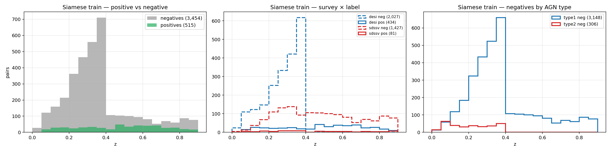
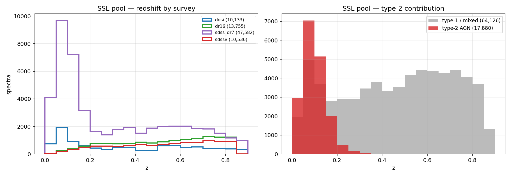
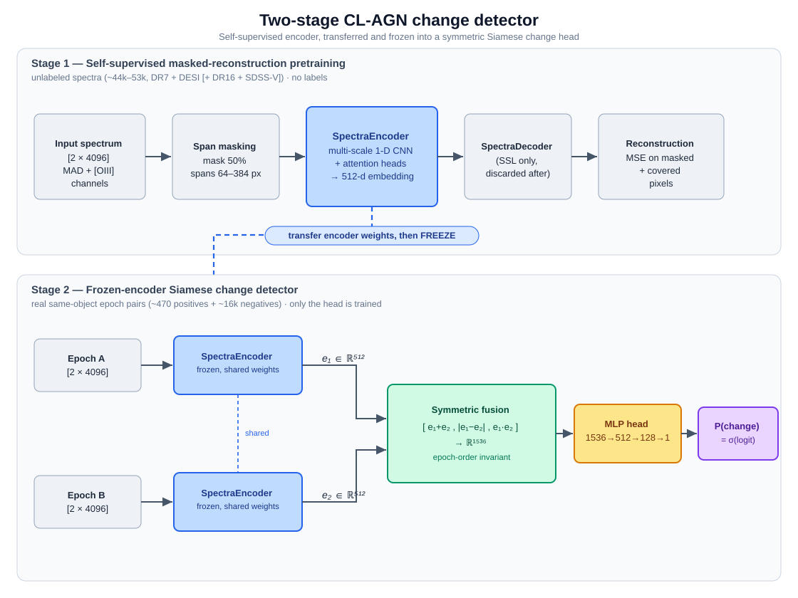
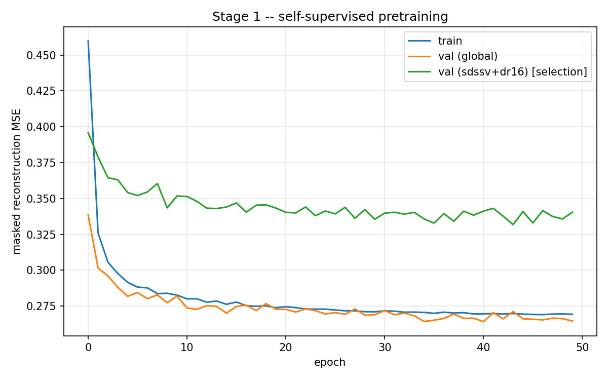
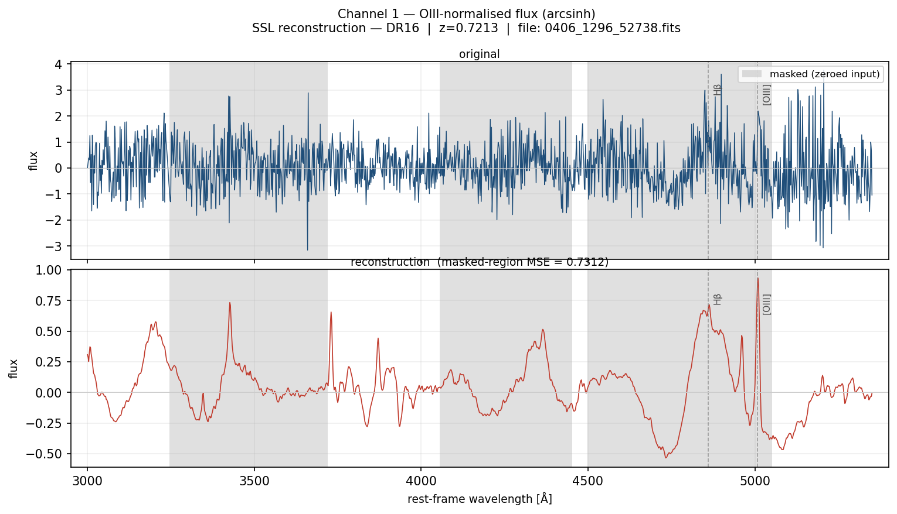
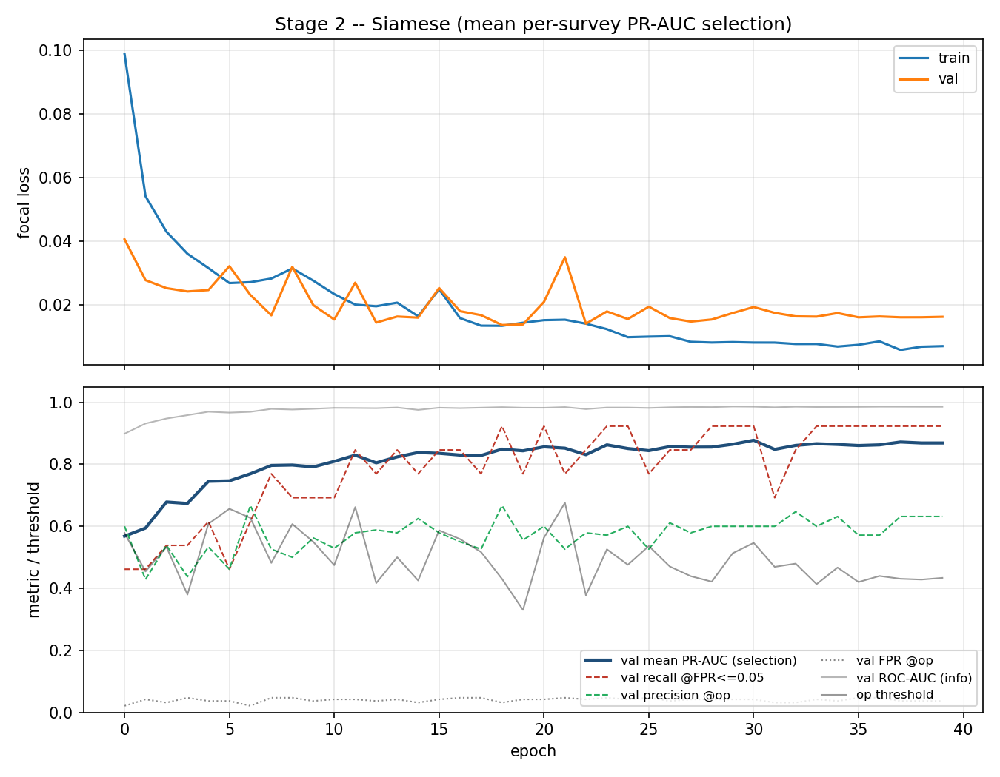
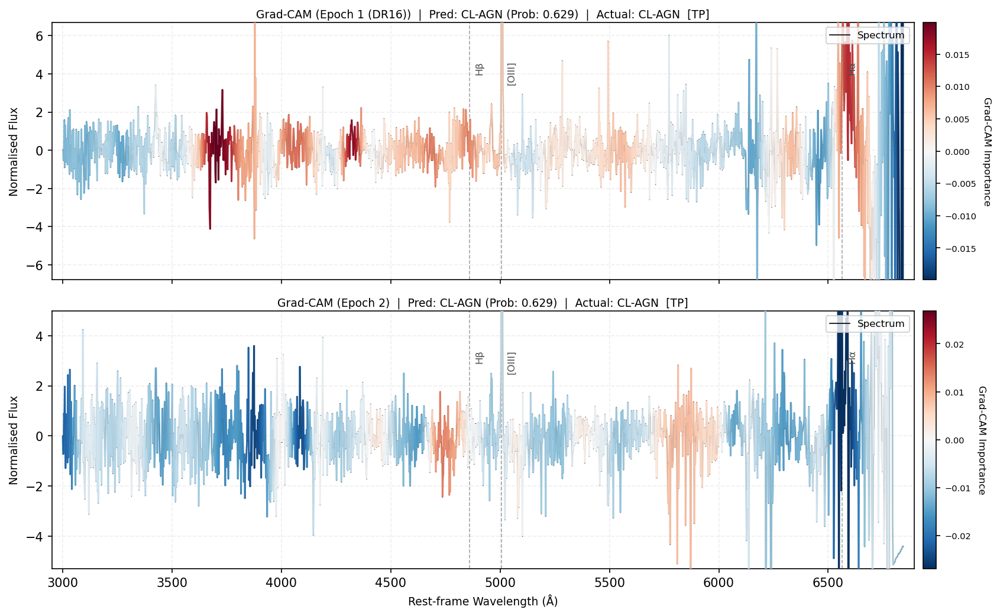
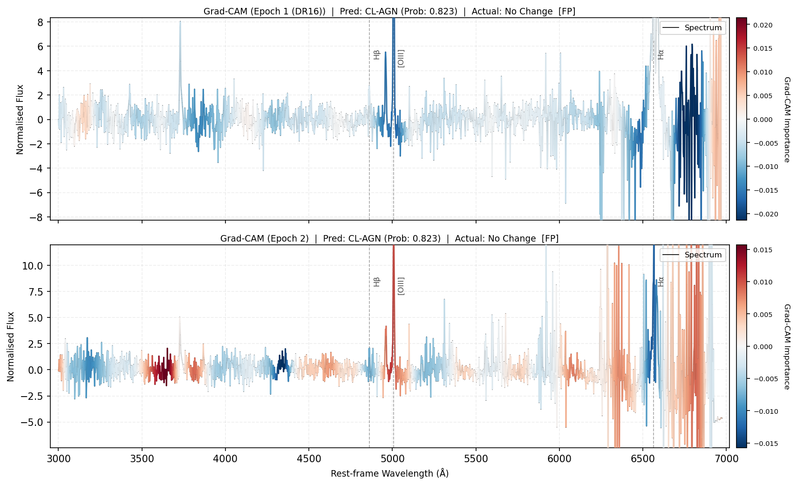

# Detecting Changing-Look AGN with Self-Supervised Deep Learning


A two-stage deep-learning pipeline that detects a rare astrophysical **state-transition** from pairs of telescope spectra from different surveys — built around **self-supervised pretraining, used for spectra reconstruction**, a **frozen-encoder Siamese head**, and a dynamic per-survey evaluation to detect shortcut learning / data imbalance. Trained on ~85k spectra and reached **PR-AUC 0.832** and **ROC-AUC 0.984**.

## ML Summary

This project demonstrates:
- self-supervised representation learning with a masked autoencoder
- Siamese neural networks for paired-input change detection
- rare-event classification under class imbalance
- scientific data preprocessing for noisy real-world spectra
- threshold selection under false-positive constraints
- interpretability and error analysis for model decisions

In ML terms, this is a rare-event binary change-detection system trained on paired 1-D signals.

---


## Headline results

| Metric | Value |
|---|---|
| **PR-AUC** | **0.832** |
| **ROC-AUC** | **0.984** |
| **Recall** at operating threshold | **88.6%** (31 / 35 confirmed CL-AGN) |
| **FPR** at operating threshold | **2.4%** (17 / 700 non-CL-AGN flagged) |

Threshold (0.547) was selected on the validation set by maximising **F₂** subject to FPR ≤ 5%, then applied to the held-out test set without modification. This operating point prioritises recovering likely CL-AGN candidates while keeping the false-positive rate low enough for manual follow-up.

<p align="center">
  
</p>

See [What we tried first](#what-we-tried-first-supervised-backbone--synthetic-pairs) for evidence that the encoder architecture learns physically meaningful features, not calibration artifacts.


## Scientific introduction and background

Some galaxies' supermassive black holes visibly **change state over just a few years** — a *changing-look AGN* (CL-AGN). These events are rare (currently estimated to be around 1% to 5% of AGN in samples) and scientifically valuable. We can identify one by comparing two spectra (intensity vs. wavelength) of the **same object** taken years apart: emission features appear or vanish. This is called a transition between Type 1 to Type 2 AGN (or vice versa). They are traditionally confirmed by manually fitting the spectra with different existing models and comparing the derived properties. Confirmed CL-AGN used as positive labels in this project are sourced from published research papers cataloguing spectroscopic transitions. **The goal of this project is to train a neural network to flag likely CL-AGN transitions directly from paired spectra, reducing the amount of manual fitting required for candidate selection which is time and compute consuming.**

As a machine-learning problem, that's **binary change-detection on pairs (static vs cl-agn)** under three conditions that make it genuinely hard:

- **Heavy class imbalance** — 515 confirmed positives against 3,454 negatives in the Siamese training set (~1:7), with no cheap way to generate more positives.
- **Heavy domain shift** — data comes from four different instruments/surveys (SDSS DR7, DR16, SDSS-V, DESI), each calibrated differently and introducing unique artifacts and noise patterns.
- **A self-imposed hard constraint** — no line-fitting / spectral-decomposition allowed anywhere; the network has to *learn* the physics that fitting would otherwise hand it.

---

## Dataset composition

<p align="center">
  
</p>

The three panels above characterise the **Siamese training set** (3,969 pairs total). Left: positives (515) are heavily outnumbered by negatives (3,454), distributed across the same redshift range — there is no easy redshift-based shortcut. Centre: both DESI and SDSS-V contribute both positive and negative pairs, but at very different rates — DESI pairs are ~18% positive (434 / 2,461) while SDSS-V pairs are only ~5% positive (81 / 1,508). This asymmetry is the source of the survey-label confound described in [Challenges](#challenges). Right: negatives are overwhelmingly static **Type 1** AGN repeat observations (3,148 of 3,454) — same object, same spectral type, two epochs, no transition. This is the hardest negative class: the model must distinguish "same object, broad lines unchanged" from "same object, broad lines appeared or disappeared."

<p align="center">
  
</p>

The two panels above characterise the **SSL pretraining pool** (~82k spectra). SDSS (Sloan Digital Sky Survey) and DESI (Dark Energy Spectroscopic Instrument) are large ground-based telescope surveys that have each observed millions of galaxies; DR7, DR16, and SDSS-V refer to successive public data releases of SDSS, each with different sky coverage, instruments, and calibration pipelines. Left: SDSS DR7 dominates (47,582 of ~82k); SDSS DR16, SDSS-V, and DESI each contribute 10–14k. This imbalance means the encoder's learned representations are biased toward DR7 spectral characteristics — objects observed only by DESI or SDSS-V may fall slightly out of distribution. Right: the pool is ~78% Type 1 / mixed AGN and ~22% Type 2, with Type 2 objects concentrated at low redshift (z < 0.2) where narrow-line AGN are more detectable.

---

## Technical approach



**Stage 1 — self-supervised encoder.** Random spans of unlabeled spectra are masked and reconstructed (a 1-D masked autoencoder). Label-free, so there's no class to shortcut on. The decoder is discarded; the **512-dim encoder** is kept.

**Stage 2 — frozen-encoder Siamese head.** The encoder is frozen and applied to both epochs; only a small MLP change-head is trained on real same-object pairs. Freezing is what lets a few hundred positives be fit without overfitting or amplifying instrument-correlated features.

**Input representation.** Each spectrum becomes a 2-channel, 4096-px rest-frame array: a robustly-normalized flux channel plus a channel anchored to a physically *constant* emission line (so a real cross-epoch change survives normalization instead of being divided away). Both arcsinh-compressed.

### Why self-supervised pretraining?

The central bottleneck is label scarcity: 515 confirmed CL-AGN against 3,454 negatives, with no way to cheaply generate more positives — these are rare real events. Even Type 1 / Type 2 labels are scarce and depend on catalogues created by other researchers.
 The solution is to separate *representation learning* from *classification*: a masked autoencoder pretrained on ~80k unlabeled spectra learns a general spectral encoder without ever seeing a label, then a small Siamese head trained on the scarce labeled pairs handles the actual detection. The encoder learns from the data that's abundant; the classifier only needs to learn from what's rare. 

---

### What we tried first: supervised backbone + synthetic pairs

Before adopting self-supervised pretraining, an earlier version trained a convolutional backbone as a **Type 1 / Type 2 spectral classifier**, then constructed *synthetic* CL-AGN pairs by pairing an unrelated Type 1 and Type 2 spectrum from different objects — the idea being that a pair where one spectrum looks like Type 1 and the other looks like Type 2 should resemble a real transition.

Results were poor. Two compounding problems:

- **Synthetic pairs don't capture the real signal.** A genuine CL-AGN transition involves subtle, object-specific changes in specific emission lines against a shared continuum background. Pairing unrelated objects introduces spurious differences — flux level, continuum shape, redshift noise — that swamp the actual transition signal. The model learned to detect "these two objects look spectrally different," not "this object changed."
- **Domain shift across surveys.** Training data spanned four instruments with different calibrations and noise patterns. The backbone could latch onto instrumental signatures rather than physical line features.

To verify the architecture itself wasn't the bottleneck, the same backbone was tested on a held-out masked evaluation: emission lines were blanked out and the classifier re-evaluated. Accuracy dropped from **99.5% → 39%** (below the majority-class baseline), confirming the network had learned to rely on emission line features — the right signal — rather than calibration artifacts. The problem was the training objective, not the architecture's capacity.

<p align="center">
  
  &nbsp;&nbsp;
  
</p>
<p align="center"><em>Left: full spectra — near-perfect classification. Right: emission lines masked — collapses below majority-class baseline, confirming the architecture learns emission line features, not calibration artifacts.</em></p>

This motivated the shift to self-supervised pretraining on unlabeled spectra, which forces the encoder to learn general spectral structure without any class to shortcut on.

---

### Data representation & training

Each spectrum pair is converted to a **2-channel, 4096-pixel rest-frame array** before any learning:

- **Channel 0** — continuum-subtracted flux, robustly normalised by the median absolute deviation (MAD). This isolates the emission line shapes, making them comparable across objects and epochs regardless of flux calibration differences between instruments.
- **Channel 1** — The same original flux is divided by the amplitude of the [O III] 5007 Å  emission line, measured on the raw flux before MAD normalisation. Because [O III] is assumed to remain constant during CL-AGN transitions, this channel normalises different flux calibration between different instruments.

Both channels are arcsinh-compressed to handle the dynamic range of emission-line spikes.

The **Siamese head** is trained with **binary focal loss** (α = 0.5, γ = 2) to down-weight the large number of easy negatives in the heavily imbalanced dataset (≈ 1:7 positive ratio after oversampling). The batch sampler targets **30% positives per batch** (oversampled), and the AdamW head learning rate is 1 × 10⁻³ over 40 epochs with cosine annealing. The encoder is frozen throughout Stage 2, so only the ≈ 500k-parameter MLP head is updated. Checkpoint selection uses **F₂** (which weights recall twice as heavily as precision) — matching the deployment goal of surfacing a short candidate list for human inspection rather than maximising purity.

### Testing various datasets and data preprocessing

**Continuum subtraction in ch0.** Two runs were compared — identical architecture, data, and hyperparameters, differing only in whether the smooth continuum was subtracted from ch0 before MAD normalisation:

| Configuration | Recall | FPR | PR-AUC |
|---|---|---|---|
| Continuum subtracted + MAD (full DR7) | **88.6%** (31/35) | 2.4% | **0.832** |
| Raw flux + MAD only (full DR7) | 80.0% (28/35) | 2.6% | 0.812 |
| Continuum subtracted + SDSS-V weighted SSL loss (full DR7) | in progress | — | — |

Continuum subtraction isolates emission line shapes from the slowly-varying flux baseline, giving the encoder a cleaner signal to reconstruct and the Siamese head a sharper change feature to detect. The 8-point recall difference confirms it is a meaningful preprocessing choice for this task.

---

## Challenges

### Survey-label confound

Both DESI and SDSS-V contribute positive and negative pairs, but at very different rates: **DESI pairs are ~18% positive** (434 / 2,461) while **SDSS-V pairs are only ~5% positive** (81 / 1,508). A model could exploit this asymmetry by learning "DESI-style spectral characteristics → higher score" rather than detecting actual line transitions — reaching good accuracy without ever learning any physics. To catch this, every checkpoint was evaluated with a **per-survey breakdown**: if DESI pairs scored systematically higher than SDSS-V pairs *within the same label class*, the model was shortcutting on instrument identity. Monitoring this split throughout training was essential to trust the final results.

A structural gap remains: DESI negatives are underrepresented relative to DESI positives. Acquiring more same-survey DESI negative pairs would be the highest-leverage data addition for future work.

### SSL encoder bias

The SSL pool is dominated by SDSS DR7 (~58% of spectra), so the encoder is better calibrated to DR7 spectral characteristics than to SDSS-V or DESI. The loss curve below makes this visible: the green line — validation loss computed on SDSS-V + DR16 spectra only — sits persistently higher than the global validation loss, meaning the encoder reconstructs non-DR7 surveys less accurately.

<p align="center">
  
</p>

Checkpoint selection used the SDSS-V + DR16 validation loss (green) rather than the global loss as the selection criterion — this is a more honest signal for how the encoder will generalise to the surveys most relevant to the Siamese head. To directly address the DR7 dominance, an ablation capped the DR7 contribution to the SSL pool. Downstream Siamese performance was actually worse: the encoder benefits from the volume of DR7 data even at the cost of some survey bias, likely because the additional spectra improve the quality of the learned spectral representations overall. The bias is therefore acknowledged but accepted as a current limitation.

---

## Repository layout

```
src/
  predict.py                # ← inference on new data (see below)
  pretrain_ssl.py           # Stage 1 — self-supervised pretraining
  train_siamese_v2.py       # Stage 2 — frozen-encoder Siamese, recall-first selection
  eval_clagn_test.py        # held-out eval: per-source / per-redshift / per-object ranking
  gradcam_pairs.py          # input-gradient visualisation: TP/FP/TN/FN pair plots
  plot_ssl_reconstruction.py# SSL reconstruction diagnostic (both channels)
  architectures_v2.py       # SpectraEncoder, MaskedSpectraAutoencoder, SiameseChangeNet
  datasets_v2.py            # SSL + real-pair datasets, pair-array cache
  preprocessing_oiii.py     # 2-channel representation, line anchor, masking, rest-frame grid
  data_preprocessing.py     # FITS → arrays, sky-line removal, SNR cut, continuum
config_v2.yml               # pipeline config (paths + hyperparameters)
models/
  continuum_subtracted_full_dr7/  # best model (PR-AUC 0.832) — checkpoints + eval artifacts
  raw_continuum_full_dr7/         # ablation: no continuum subtraction (PR-AUC 0.812)
  raw_continuum_dr7_capped/       # ablation: capped DR7 SSL pool
```


### Running inference on new data

Prepare a CSV with one row per same-object spectrum pair:

| `file1` | `file2` | `ra` | `dec` | `z` |
|---|---|---|---|---|
| spec-epoch1.fits | spec-epoch2.fits | 185.3 | 22.1 | 0.21 |

`file1`/`file2` are FITS basenames (or paths relative to `--spectra-dir`). `ra`, `dec`, `z` are optional — all input columns pass through to the output. Per-epoch redshifts can be given as `z1`/`z2`; if absent the FITS header is used as fallback.

```bash
python src/predict.py \
    --spectra-dir  data/spectra/ \
    --pairs-csv    data/my_pairs.csv \
    --output       results/predictions.csv
```

The output CSV adds `prob` (P(CL-AGN)) and `label` (1 if `prob ≥ 0.547`) to every input row, sorted by probability descending. Each unique FITS file is read only once regardless of how many pairs it appears in, keeping runtime practical for tens of thousands of pairs.

### Training from scratch

```bash
python src/pretrain_ssl.py                    # Stage 1
python src/train_siamese_v2.py               # Stage 2
python src/eval_clagn_test.py                # held-out evaluation
python src/gradcam_pairs.py --config config_v2.yml   # interpretability plots
```

---

## Example outputs

**SSL reconstruction (Stage 1).** The masked autoencoder learns to reconstruct randomly-masked spans — shown here for both input channels (MAD-normalised flux and OIII-anchored amplitude):

<p align="center">
  
</p>

**Siamese training curve (Stage 2):**

<p align="center">
  
</p>

**Input-gradient interpretability.** Each spectrum is coloured by the signed gradient of the CL-AGN logit with respect to the flux at that wavelength. Red regions pushed the prediction toward CL-AGN; blue pushed against it. Example true positive and false positive — in the FP case the model focuses on Hα at the red edge, where coverage drops and broad-wing structure is hard to rule out:

<p align="center">
  
</p>
<p align="center">
  
</p>

---
