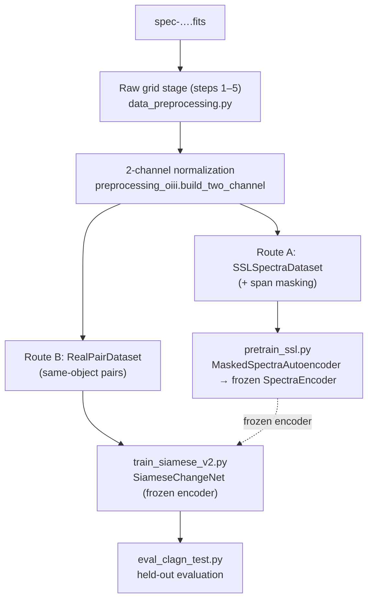

# The Spectra Path — from a `.fits` file to training / evaluation

This document traces the full journey of a single spectrum (`spec-….fits`) through the
pipeline, naming the file responsible for each step. Every spectrum follows the **same
preprocessing recipe**, then forks into one of two routes depending on its role:

- **Route A** — an *unlabeled* spectrum used for self-supervised encoder pretraining.
- **Route B** — a spectrum that is one epoch of a *labeled, same-object pair* used to train
  and evaluate the Siamese change detector.

The two routes share steps 1–5 and the 2-channel normalization; they differ only in the code
entry point (a batch path that writes parquet vs. a lazy path that builds pair arrays on the fly).

---

## Overview

> Note: in Route A the grid stage is run **ahead of time** and cached to parquet; in Route B it
> is run **lazily at load time** by `datasets_v2.fits_to_flat`, which re-implements the same
> chain and imports `remove_sky_line` + `MASTER_GRID` from the shared modules so the two stay
> in sync.

---

## Shared raw stage — FITS → rest-frame grid

| # | Step | What happens | File · function |
|---|---|---|---|
| 1 | Read FITS | extract flux, wavelength, redshift `z`, median SNR | `data_preprocessing.py` · `process_single_spectrum`, `get_redshift`, `get_snr` |
| 2 | Sky-line removal | detect the 5577.3 Å [O I] night-sky residual where it spikes > 4× local std and linearly interpolate over it | `data_preprocessing.py` · `remove_sky_line` |
| 3 | De-redshift | shift to rest frame: `wave_rest = wave_obs / (1+z)`, `flux_rest = flux_obs · (1+z)` (flux-conserving) | `data_preprocessing.py` · `process_single_spectrum` |
| 4 | Resample to master grid | linear-interpolate onto a fixed rest-frame grid (3000–10400 Å, 4096 px, ≈1.81 Å/px); out-of-coverage pixels → NaN, recorded in a **per-pixel validity mask**, then zero-filled | `data_preprocessing.py` (`MASTER_GRID` defined in `preprocessing_oiii.py`) |
| 5 | Continuum (optional) | masked moving-average continuum (~313 Å / 173-px window over covered pixels only); **kept** in channel 0 by default | `data_preprocessing.py` · `morphological_continuum_subtraction` |

The output of this stage is a **single** flux array on the master grid plus its validity mask.
The two-channel normalization is a **separate, downstream** step (below) — it does **not** happen
in `data_preprocessing.py`.

---

## 2-channel normalization (shared)

The single grid-flux array is turned into a `[2, 4096]` input. The two channels are the **same
flux normalized two different ways** — `preprocessing_oiii.build_two_channel`:

| Channel | Normalization | Purpose | File · function |
|---|---|---|---|
| **0** | **MAD**: `(flux − median) / (1.4826 · MAD)`, computed over covered pixels (per-spectrum, self-referential), with edge taper | robust, always-available **shape** channel; also the fallback | `preprocessing_oiii.py` · `mad_normalize` |
| **1** | **[O III] 5007**: divide by the spectrum's own local-continuum-subtracted [O III] 5007 flux | puts both epochs on a **common, physically-constant amplitude scale**, so a real broad-line / continuum change survives as a genuine cross-epoch difference | `preprocessing_oiii.py` · `measure_oiii_flux` (bands: core 4996–5018 Å; blue 4970–4990 Å; red 5020–5045 Å) |

Both channels are then **arcsinh-compressed** to tame the dynamic-range tail.

**Caveats.**
- The two channels are **not independent** — they are the same underlying flux divided by
  different scalars, so they are highly correlated.
- Channel 1 is not always a true [O III] normalization: when the [O III] SNR < 4 (or flux is
  negligible), `build_two_channel` **falls back** to copying the MAD channel, so for those
  spectra both channels carry the same normalization. The reliability flag is recorded in the
  returned `info` dict (`oiii_reliable`).

---

## Route A — unlabeled spectrum → SSL pretraining

| # | Step | What happens | File · function |
|---|---|---|---|
| A6 | Batch grid stage + quality clean | run steps 1–5 over a folder of FITS, drop low-SNR (≥ 8 for the SSL pool) and low-coverage spectra, write the grid flux to **parquet** | `data_preprocessing.py` · `build_unified_ssl_parquet` → `run_preprocessing`, `build_agn_catalog`, `clean_dataset` *(orchestrated by the survey-specific `build_ssl_*` scripts, which are not shipped in this repo)* |
| A7 | Load parquet → 2 channels | parquet row provides channel 0 directly; channel 1 + arcsinh built at load time | `datasets_v2.py` · `SSLSpectraDataset.__getitem__` → `preprocessing_oiii.build_two_channel` |
| A8 | Span masking | blank random contiguous spans (drawn from covered pixels) for the reconstruction objective | `architectures_v2.py` · `apply_span_mask` (invoked in the training loop) |
| A9 | Pretrain encoder | masked-autoencoder reconstruction; MSE scored on masked + covered pixels; decoder discarded, **encoder saved (`.pth`)** | `pretrain_ssl.py` · models `MaskedSpectraAutoencoder` / `SpectraEncoder` (`architectures_v2.py`) |

---

## Route B — labeled spectrum → Siamese train / eval

| # | Step | What happens | File · function |
|---|---|---|---|
| B6 | Pair definition | a pickle lists same-object two-epoch pairs + labels (the assumed prepared input) | pickle referenced via `config_v2.yml` / `paths_v4.py` |
| B7 | FITS → grid (lazy) | re-run steps 1–5 per spectrum on the fly (reuses `remove_sky_line`, `MASTER_GRID`) | `datasets_v2.py` · `fits_to_flat` |
| B8 | Build 2 channels + cache | `mad_normalize` → ch0, `build_two_channel` → ch1 + arcsinh; result cached to `.npz` | `datasets_v2.py` · `load_or_build_pair_arrays` → `preprocessing_oiii.{mad_normalize, build_two_channel}` |
| B9 | Serve pairs | emit `(e1, e2)` 2-channel tensors + label, with train/test split filtering | `datasets_v2.py` · `RealPairDataset.__getitem__` |
| B10 | Train Siamese head | load the **frozen** encoder, train the symmetric change-head `[e1+e2, |e1−e2|, e1·e2]`, select checkpoint on mean per-survey PR-AUC | `train_siamese_v2.py` · model `SiameseChangeNet` (`architectures_v2.py`) |
| B11 | Evaluate | held-out test: per-source / per-redshift / per-object probability ranking; deployment threshold = max recall at FPR ≤ budget | `eval_clagn_test.py` |

---

## File responsibility summary

| File | Responsibility |
|---|---|
| `data_preprocessing.py` | Raw FITS → rest-frame grid (read, sky-line, de-redshift, resample + mask, continuum); batch build of SSL parquets; dataset cleaning |
| `preprocessing_oiii.py` | The 2-channel normalization (`mad_normalize`, `measure_oiii_flux`, `build_two_channel`), `MASTER_GRID` and line-band definitions |
| `datasets_v2.py` | `fits_to_flat` (lazy grid stage for pairs), `SSLSpectraDataset`, `load_or_build_pair_arrays` + cache, `RealPairDataset` |
| `architectures_v2.py` | `SpectraEncoder`, `MaskedSpectraAutoencoder`, `SiameseChangeNet`, `apply_span_mask` |
| `pretrain_ssl.py` | Stage 1 — self-supervised encoder pretraining |
| `train_siamese_v2.py` | Stage 2 — frozen-encoder Siamese training + checkpoint selection |
| `eval_clagn_test.py` | Held-out evaluation and candidate ranking |
| `config_v2.yml`, `paths_v4.py` | Paths and hyperparameters for both routes |
